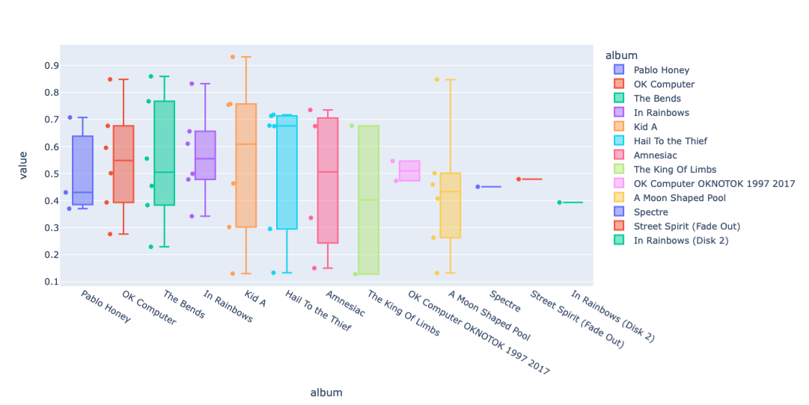
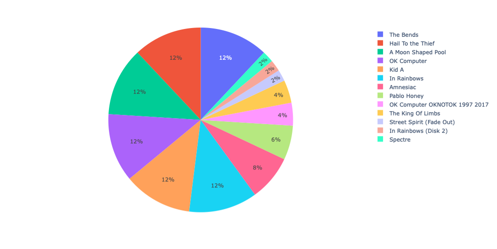

# Getting Started

Splotify is a python library for easily graphing and visualizing your Spotify data.

[](https://github.com/cordeliachen/splotify/actions?query=workflow%3A%22Build+Status%22)
[](https://codecov.io/gh/cordeliachen/splotify)


[](https://pypi.org/project/splotify/)

## Installation

Install the library by running:

`pip install splotify`

## Usage

1. First, you need to get your `SPOTIPY_CLIENT_ID`, `SPOTIPY_CLIENT_SECRET`, and redirect uri. [Here](https://www.youtube.com/watch?v=3RGm4jALukM) is a video created by Spotipy that explains how to do so. 


2. Declare a [SpotifyApi](source/splotify.html#splotify.spotifyapi.SpotifyApi) object that allows you to access data from Spotify.

3. Declare a [Data](source/splotify.html#splotify.data.Data) object to store all the songs which you want to plot. You can add individual or multiple tracks, albums, or playlists at a time.

4. Determine the kind of data you want to plot:

   - [Category plots](source/splotify.plots.html#splotify.plots.category.CategoryPlot) (bar charts, pie charts) allow you to plot songs by groups (i.e. artists or albums).
   - [Audio feature plots](source/splotify.plots.html#splotify.plots.audiofeatures.AudioFeaturesPlot) allow you to plot songs by their audio features.

5. If you need to look up the Spotify ids of tracks, albums, artists, or playlists, you can use [search_id](source/splotify.html#splotify.helpers.search_id) (for general searches) or [my_id](source/splotify.html#splotify.helpers.my_id) (for user-specific playlists) functions.

Here is an example analyzing Spotify's "This is Radiohead" playlist:

```python
import splotify.spotifyapi as spotifyapi
import splotify.data as data
import splotify.plots.audiofeatures as af
import splotify.plots.category as c

sp = spotifyapi.SpotifyApi(
    "YOUR SPOTIPY_CLIENT_ID",
    "YOUR SPOTIPY_CLIENT_SECRET",
    "YOUR REDIRECT URI",
)

d = data.Data(sp)

# add tracks from the "This is Radiohead" playlist
d.add_playlist("37i9dQZF1DZ06evO2VxlyE")

# view data about the tracks' audio features
afp = af.AudioFeaturesPlot(sp, d.get_data(), ["energy", "loudness"])

# scatter plot of energy vs. loudness of the tracks in the playlist
afp.scatter_plot_2d(color="album")

# box plot of the tracks' energy values, grouped by album
afp.box_plot(["energy"], groupby="album")


cp = c.CategoryPlot(d.get_data())

# pie chart of albums in the playlist
cp.pie_chart()

```

This code produces the following plots:



